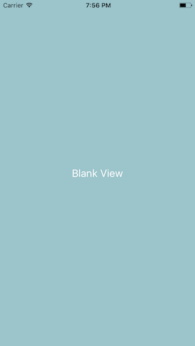
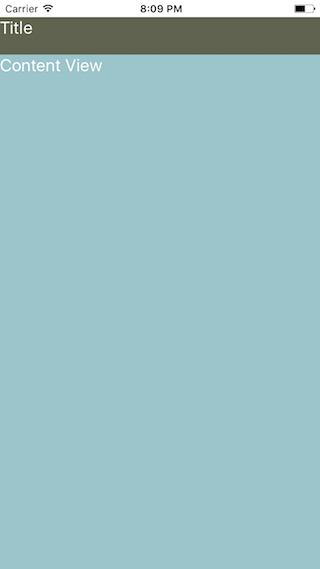
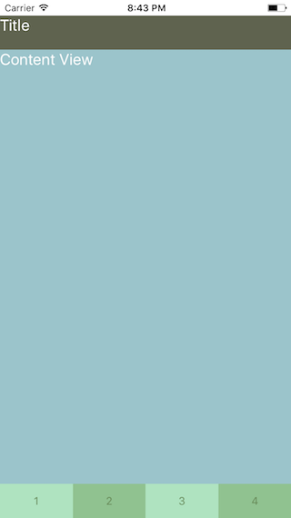
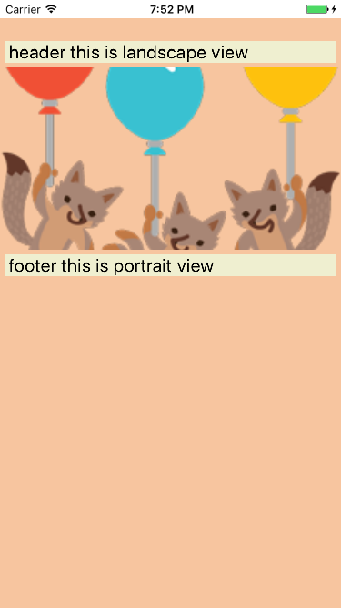
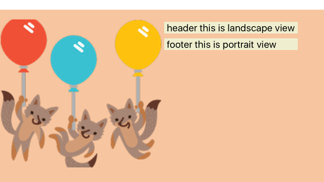
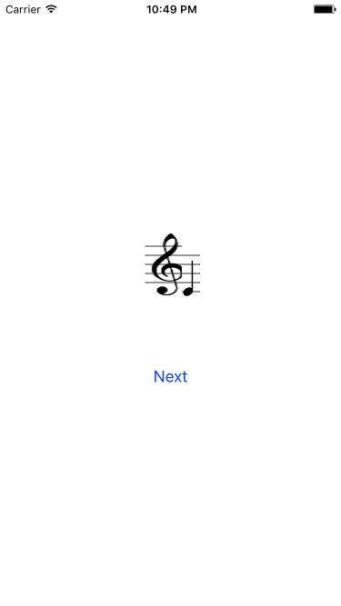

# React Native Layouts (rnlayouts)
Collection of common mobile app layouts built with React Native

###Test with [rnplay.org](http://rnplay.org)

Fork the [project](https://rnplay.org/apps/YxvZRg) and follow the steps described in the rnplay project.

###Test locally

* Download this project 
* `cd` to the downloaded directory 
* Run `npm install` 
* `react-native run-ios` or `react-native run-android` 

###Layout1 - Blank view

###Layout2 - Blank view with Navbar (statusbar)

###Layout3 - Blank view with Navbar & footer

###Layout4 - Blank view with Navbar & Tabbar

###Layout5 - Adaptive layout (different layouts for portrait and landscape)
 

###Layout6 - Gallery layout (left, right arrows overlay)

It is straight forward of 3 column layout with flex and magic of -ve margin. But I spent way much time(in days) thinking

###Layout7 - Overlapping images

Based on layout6.js, but to check feasibility of http://www.palaniraja.com/letsreadnotes/ 

[YouTube demo](youtu.be/c0Im3BnzZc4)