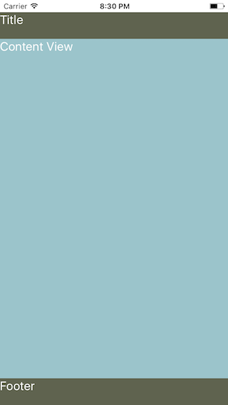

# React Native Layouts (rnlayouts)
Collection of common mobile app layouts built with React Native

###Test with [rnplay.org](http://rnplay.org)

Fork the [project](https://rnplay.org/apps/YxvZRg) and follow the steps described in the rnplay project.

###Layout1 - Blank view

###Layout2 - Blank view with Navbar (statusbar)

###Layout3 - Blank view with Navbar & footer

###Layout4 - Blank view with Navbar & Tabbar
